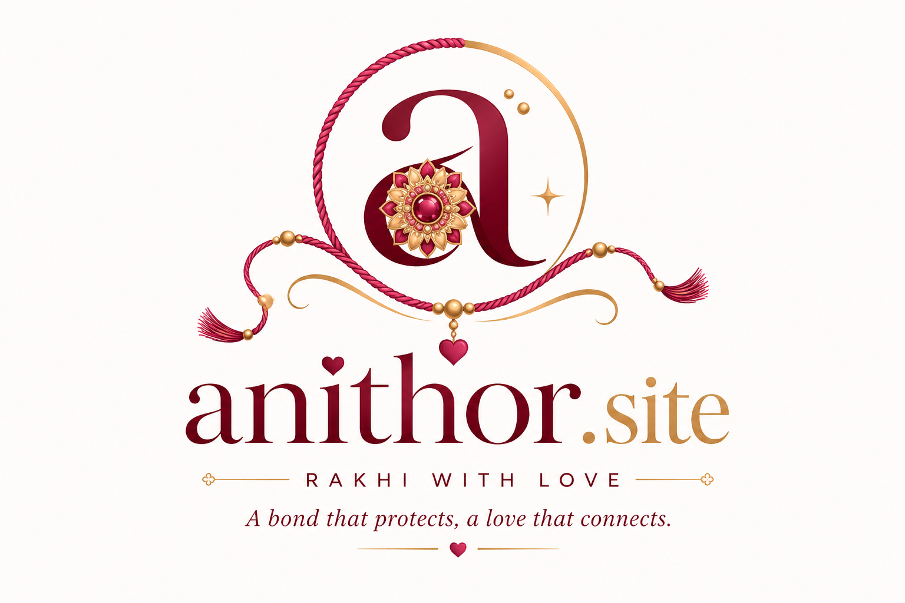

# anithor bond · Rakhi with Digital Love

> **A bond that protects, a love that connects**



[](https://anithor.site)
[](https://github.com/susantedit/RAkshabandan)
[](https://kantarajluitel.tech)

---

## 🌟 Overview

**anithor bond** (`anithor.site`) is an interactive 3D digital Raksha Bandhan experience built for sisters and brothers who negotiate. It allows sisters to forge custom 3D Rakhis, arrange traditional thalis, and attach an itemized Sibling Tax invoice. Brothers can strike back with pre-emptive defenses, troll vaults, budget contracts, or fair-odds Shagun Roulette wheels.

Everything is **100% encrypted end-to-end (AES-GCM)** directly inside the URL hash (`#s=`, `#b=`, `#sr=`). No databases, no logins, no servers — the payload lives exclusively inside the link you share.

---

## 🚀 Key Features

- **🧵 3D Rakhi Forge & Thali Builder**: Real-time 3D Three.js interactive preview with customizable threads (Gold Mesh, Cyber Neon, Crimson, Crystal), gems, and mithai (Kaju Barfi, Ladoo, Rasbari).
- **🔐 Shagun Vault & Troll Rewards**: Lock gifts or meme sound effects inside a tap-cracking vault. Sound effects include:
  - *Paisa Hi Paisa Hoga* (`/paisa hi paisa hoga.m4a`)
  - *Broke Brother Arc / Nothing* (`/nothing.m4a`)
  - *Default Brother Meme* (`/brother.m4a`)
  - *Blessings & Zero Payout* (`/bless.m4a`)
- **📜 Budget Contract & Shagun Roulette**: Non-negotiable signed caps or fair 10-slot wheel of fate.
- **📸 Instagram Story Card Exporter**: Generates a downloadable 1080×1920 high-res Story Card canvas with branding (`anithor bond`, tagline, and `@susantgamerz` tag reminder).
- **🎵 Single-Channel Audio System**: Auto-playing background music with one-tap mute control (`🎵` / `🔇`) and automatic pause/resume during meme sound playback.
- **🇳🇵 NPR Currency Formatting**: Native Nepalese Rupee (`Rs.`) shagun calculations and QR payment upload option.

---

## 🛠️ Tech Stack

- **Core**: React 18, TypeScript, Vite
- **3D Engine**: Three.js, `@react-three/fiber`, `@react-three/drei`
- **Styling**: Tailwind CSS & Vanilla CSS Design Tokens
- **Encryption**: AES-GCM & Web Crypto API (`deflate-raw` compression)
- **Audio Engine**: HTML5 Audio API with pause/resume synchronization

---

## 📦 Getting Started

### Prerequisites
- Node.js (v18 or higher)
- npm or pnpm

### Installation

```bash
# Clone the repository
git clone https://github.com/susantedit/RAkshabandan.git

# Navigate to project directory
cd RAkshabandan

# Install dependencies
npm install
```

### Running Locally

```bash
# Start Vite development server
npm run dev
```
Open your browser at `http://localhost:5173`.

### Production Build

```bash
# Build production bundle
npm run build
```

---

## 👤 Creator & Community

Created with ❤️ by **Kanta Raj Luitel (Susant Luitel)**

- 🌐 **Website**: [kantarajluitel.tech](https://kantarajluitel.tech)
- 📸 **Instagram**: [@susantgamerz](https://instagram.com/susantgamerz) *(Don't forget to tag on Instagram!)*
- 🐙 **GitHub**: [@susantedit](https://github.com/susantedit)
- 🔗 **Repository**: [https://github.com/susantedit/RAkshabandan](https://github.com/susantedit/RAkshabandan)

### Social Links:
[](https://facebook.com/Kantaraj.Luitel)
[](https://instagram.com/susantgamerz)
[](https://linkedin.com/in/kantaraj-luitel)
[](https://pinterest.com/susantluitel)
[](https://reddit.com/user/Successful-Twist2608)
[](https://tiktok.com/@vortexeditz34)
[](https://x.com/Susantedit)
[](https://codepen.io/susant-gamerz)
[](https://github.com/susantedit)
[](https://wa.me/9779708838261)
[](mailto:susantedit@gmail.com)

---

## 📄 License

This project is open source and available under the [MIT License](LICENSE).
