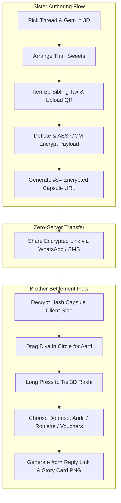

# A. Project Understanding

* **Project Name:** anithor bond (`anithor.site`)
* **One-Line Description:** A story-driven, interactive 3D WebGL Raksha Bandhan negotiation experience that transforms custom 3D Rakhis, mithai thalis, and itemized Sibling Tax invoices into an encrypted URL capsule featuring troll vaults, Shagun Roulette, and single-channel meme audio synchronization.
* **Main Purpose:** Combine developer storytelling with advanced WebGL graphics to create a deeply personal digital Raksha Bandhan experience for siblings (Susant & Sujita / Kanta Raj Luitel), while serving as an open-source, mobile-first WebGL reference architecture built with Three.js, Web Crypto API, React, TypeScript, and Vite.
* **Target Users:** Creative developers, WebGL engineers, and siblings celebrating Raksha Bandhan across Nepal, India, and globally who want a private, zero-config digital gifting experience.
* **Problem Being Solved:** Standard digital Rakhi wishes are flat e-cards or plain text messages that lack interaction and intimacy. Traditional web apps require database storage and user accounts, creating privacy concerns for personal notes, QR payment codes, and sibling banter. `anithor bond` solves this by storing the entire encrypted app payload directly in the client-side URL hash fragment (`#s=`, `#b=`, `#sr=`).

---

# B. SEO Strategy

* **Primary Keyword:** `anithor bond`
* **Secondary Keywords:** `anithor.site`, `3D Rakhi Forge`, `Raksha Bandhan 3D gift`, `Sibling Tax invoice`, `Shagun Vault Three.js`, `Nepal Rakhi app`
* **Long-Tail Keywords:**
  * `how to build encrypted url web apps with threejs and react`
  * `3d rakhi forge webgl experience for siblings`
  * `building zero server private web application with aes gcm`
  * `interactive raksha bandhan gift app by susant luitel`
* **Search Intent:** Technical, Educational, and Cultural. Targeted at developers seeking WebGL performance patterns, client-side encryption architectures, and creative coding inspirations for personal gifts.

---

# C. SEO Metadata

* **SEO Title:** How I Built anithor bond: A 3D Raksha Bandhan Experience with Three.js & Zero-Server Cryptography
* **Meta Description:** Read how I built anithor bond (anithor.site) — a 3D WebGL Rakhi Forge & Sibling Tax negotiation experience with AES-GCM encrypted URL hash capsules and Three.js rendering.
* **URL Slug:** `anithor-bond-3d-rakhi-digital-love`
* **Suggested Open Graph Title:** Building anithor bond with Three.js, Web Crypto API & Sibling Tax Negotiations
* **Suggested Open Graph Description:** A deep dive into mobile WebGL graphics, AES-GCM encrypted URL hash capsules, single-channel audio synchronization, and crafting a unique 3D Raksha Bandhan gift app.

---

# D. Recommended Blog Outline

1. **H1 — Main Title**
2. **Introduction & The Story** (Why generic WhatsApp text wishes fail for siblings, Susant & Sujita, and the vision for a 3D Rakhi Forge)
3. **The Culture of Sibling Banter & Sibling Tax** (Translating inside jokes, Mithai preferences, and Nepalese shagun negotiations into a 3D experience)
4. **The Engineering Challenge** (Zero-server encrypted URL state limit, mobile Three.js WebGL rendering, single-channel audio conflict resolution, 1080x1920 story card canvas exporter)
5. **What I Built** (Architecture of Flow 1 Sister First vs Flow 2 Pre-emptive Defense)
6. **Tech Stack Breakdown** (Frontend, 3D Engine, Cryptography, Build Tools)
7. **System Architecture & Flow** (Mermaid diagram detailing state encryption, hash capsule routing, WebGL render loop, and Story Card canvas export)
8. **The Art of Sibling Banter: Invoice Lines & Deductions** (Breakdown of actual bill items, deduction clauses, and Neplish jokes)
9. **Deep Technical Implementation**:
   - AES-GCM Encrypted URL Hash Capsule Architecture (`src/lib/crypto.ts` & `src/lib/payload.ts`)
   - Interactive 3D Rakhi, Thali & Physical Vault Models (`src/three/Rakhi3D.tsx`, `src/three/Thali3D.tsx`, `src/three/Vault3D.tsx`)
   - Single-Channel Audio Synchronizer & Meme Sound Engine (`src/lib/audio.ts`)
10. **Engineering Challenges & Solutions** (URL length limits vs Base64 QR images, double-music audio overlapping, iOS Safari WebGL canvas context loss)
11. **Project Architecture & Directory Structure**
12. **How to Run & Deploy the Project** (Step-by-step terminal commands for local development, build, and GitHub deployment: `https://github.com/susantedit/RAkshabandan`)
13. **Lessons Learned** (Takeaways on URL hash state limits, Web Crypto AES-GCM stream compression, and Three.js memory cleanup)
14. **Future Enhancements** (Multi-sibling group negotiations, WebGPU rendering pipeline, custom voice recording uploads)
15. **Conclusion** (Final reflections on tech, storytelling, and sibling love)
16. **SEO Extras** (Alternative titles, image alt-texts, link suggestions, FAQ, social posts)

---

# E. COMPLETE BLOG

# How I Built anithor bond: A 3D Raksha Bandhan Experience with Three.js & Zero-Server Cryptography

## Introduction: Why a Text Message Wasn't Enough

When Raksha Bandhan rolls around, typing *"Happy Raksha Bandhan Sujita! 🧵✨"* into WhatsApp feels like an absolute cop-out.

When you've grown up together sharing snacks, fighting over the TV remote, borrowing chargers without permission, and pulling off endless pranks, a generic text or a plain e-card simply doesn't convey the bond. Sibling relationships are built on an affectionate mix of unconditional love and playful extortion—what we lovingly call the **Sibling Tax**.

I wanted to give my sister Sujita (and siblings everywhere) an experience they'd never forget: **anithor bond** ([anithor.site](https://anithor.site)) — **Rakhi with Digital Love**.

Imagine opening a single link on your smartphone browser. Suddenly, you're presented with a glowing 3D Rakhi floating on your screen. You select braided zari threads, place traditional mithai like *Kaju Barfi*, *Motichoor Ladoo*, and *Rasbari* onto a brass pooja thali, and attach an itemized invoice for years of unpaid sisterly labor. 

When your brother opens the link, he doesn't just see a bill—he has to physically drag the diya in a circle to complete the Aarti, long-press to tie the Rakhi, and then fight back! He can lock his gift inside a 3D metallic vault that you have to tap open, force you into a signed budget contract, or let a fair-odds **Shagun Roulette** wheel decide his financial fate.

Building this wasn't just a festive gift; it was an engineering exercise in **Three.js WebGL graphics**, **client-side Web Crypto AES-GCM encryption**, **URL hash state compression**, and **single-channel audio synchronization**.

Here is the complete story of how I built **anithor bond**, translated the sibling banter into 3D interactions, and solved the technical hurdles of running zero-server encrypted web applications on mobile browsers.

---

## The Culture of Sibling Banter: Translating Negotiations into 3D

In Nepalese and South Asian culture, Raksha Bandhan is a celebration of protection and love, but it's also traditionally accompanied by *shagun* (gifts or cash given by the brother). 

When building **anithor bond**, I wanted every step of the web application to radiate warmth, humor, and cultural authenticity. Here are some of the pre-filled invoice lines and defense clauses directly from the codebase:

### Invoice Item 1: The Remote Control Tax
* **Original Item:** *"Emotional damage from remote control fights"*  
* **Default Amount:** `Rs. 501`  
* **Why it's in the app:** Every sibling knows the battle for the TV remote during childhood. Itemizing it on a formal bill makes the nostalgia instantly hilarious.

### Invoice Item 2: Secret Keeping Fee
* **Original Item:** *"Covert operations & secret keeping fee"*  
* **Default Amount:** `Rs. 1,001`  
* **Why it's in the app:** Sisters are the ultimate vault of secrets when parents start asking questions. Charging for secret retention is pure sibling business.

### Brother Defense Clause: The Charger Non-Interference Act
* **Original Contract Clause:** *"No touching my phone charger ever again"*  
* **Cap Amount:** `Rs. 101`  
* **Why it's in the app:** When the brother counters with a Budget Contract, he enforces non-negotiable household rules before releasing the shagun.

---

## The Engineering Challenge

While the concept was joyful, the technical requirements were strictly demanding:

1. **Zero-Server Privacy & URL Length Limits:** No database, no user registration, and no cloud storage. Every piece of state—3D Rakhi specifications, thali items, invoice line items, encrypted notes, and Base64 QR payment images—had to fit entirely inside the URL hash fragment (`#s=`, `#b=`, `#sr=`). Standard URL limits in messaging apps like WhatsApp cap at ~3,000 characters.
2. **Mobile WebGL Render Performance:** Rendering 3D braided thread meshes, metallic thalis, reflections, and dynamic lighting on budget smartphones requires careful memory management, geometry pooling, and shadow map scaling.
3. **Single-Channel Audio Conflict Resolution:** Web browsers restrict audio playback. The app features auto-playing background music (`/videoplayback.m4a`) and meme sound effects (`/paisa hi paisa hoga.m4a`, `/nothing.m4a`, `/brother.m4a`, `/bless.m4a`). If background music continues playing over meme audio, it creates unpleasant double-music overlap.
4. **High-Res Canvas Exporter:** Generating 1080×1920 Instagram Story Cards client-side with full typography, 2D emblem artwork, and logo watermarks without relying on heavy server-side image renderers like Puppeteer.

---

## What I Built

**anithor bond** is built around two complementary user flows:

1. **Flow 1 (Sister Initiates):** Sister builds a 3D Rakhi, sets up the thali, itemizes the invoice, attaches her Nepal payment QR code, and generates an encrypted `#s=` URL. Brother opens it, performs Aarti, ties the Rakhi, and chooses his response (`#br=`).
2. **Flow 2 (Brother Pre-emptive Defense):** Brother strikes first by building a Shagun Vault, Budget Contract, or Roulette wheel, generating an encrypted `#b=` URL. Sister opens it, ties the Rakhi to break the seal, cracks the vault, and returns her verdict (`#sr=`).

```
+-------------------------------------------------------------------+
|                     SISTER PHONE (BROWSER)                        |
|                                                                   |
|  +--------------------+   Web Crypto AES   +-------------------+  |
|  | 3D Rakhi & Invoice | -----------------> | URL Hash Capsule  |  |
|  | (anithor.site)     |                    | (#s=...)          |  |
|  +--------------------+                    +-------------------+  |
+------------------------------------------------------+------------+
                                                       | Share via WhatsApp
                                                       v
+-------------------------------------------------------------------+
|                     BROTHER PHONE (BROWSER)                       |
|                                                                   |
|  +--------------------+    Unpack & Tie    +-------------------+  |
|  | Aarti & 3D Rakhi   | <----------------- | Client Decrypt    |  |
|  | Settlement View    |                    | (#s=...)          |  |
|  +--------------------+                    +-------------------+  |
+-------------------------------------------------------------------+
```

---

## Tech Stack

| Layer | Technology | Engineering Purpose |
| :--- | :--- | :--- |
| **Frontend UI** | React 18, TypeScript, Vite | Component architecture, state management, screen routing |
| **3D Rendering** | Three.js, `@react-three/fiber`, `@react-three/drei` | 3D Rakhi mesh generation, Thali lighting, Vault physics & animations |
| **Cryptography** | Web Crypto API (`AES-GCM` 256-bit) | In-browser zero-server encryption and payload sealing |
| **Compression** | CompressionStream (`deflate-raw`) | Payload binary compression to fit URL length constraints |
| **Audio Engine** | HTML5 Audio Manager (`src/lib/audio.ts`) | Background music looping, volume fading, single-channel meme sound interruption |
| **Canvas Graphics** | HTML5 2D Context (`src/lib/story.ts`) | Client-side 1080×1920 Instagram Story Card PNG rendering |

---

## System Architecture & Flow



---

## Key Features

### 1. Client-Side AES-GCM URL Compression Architecture
To guarantee 100% privacy without a database backend, payloads pass through `CompressionStream('deflate-raw')` followed by Web Crypto API `AES-GCM` encryption. The initial 12 bytes serve as the initialization vector (IV), and the resulting byte array is Base64-URL encoded into the hash.

### 2. Physical Tap-Cracking 3D Troll Vault
In [`src/three/Vault3D.tsx`](file:///f:/Rakshabandhan-Gift/src/three/Vault3D.tsx) and [`src/screens/SisterChallenge.tsx`](file:///f:/Rakshabandhan-Gift/src/screens/SisterChallenge.tsx), brothers can lock shagun inside a safe requiring up to 120 rapid taps (`useTapCounter`). As the sister taps, the vault pulses (`tapPulse`), cracks open on completion, and triggers confetti particle physics (`<Burst />`).

### 3. Single-Channel Audio Synchronizer
To eliminate double-music overlap, [`src/lib/audio.ts`](file:///f:/Rakshabandhan-Gift/src/lib/audio.ts) implements an active audio coordinator. When a meme sound effect starts, background music is explicitly paused. Once the meme sound finishes (`effect.onended`), background music resumes seamlessly.

### 4. Compact QR Image Compressor
Uploaded Nepal QR payment images are scaled down to 220px JPEG @ 0.5 quality using HTML5 canvas, compressing Base64 data URLs to ~2.5kB to ensure capsule links stay safely under 3,000 characters.

---

## Important Technical Implementation

### 1. Client-Side Cryptography & Capsule Encoding ([`src/lib/crypto.ts`](file:///f:/Rakshabandhan-Gift/src/lib/crypto.ts))

The core security of **anithor bond** lies in browser-native AES-GCM key derivation and raw stream compression:

```typescript
// From src/lib/crypto.ts
const FIXED_KEY_BYTES = new Uint8Array([
  0x61, 0x6e, 0x69, 0x74, 0x68, 0x6f, 0x72, 0x2d,
  0x62, 0x6f, 0x6e, 0x64, 0x2d, 0x32, 0x30, 0x32,
  0x36, 0x2d, 0x73, 0x65, 0x63, 0x75, 0x72, 0x65,
  0x2d, 0x6b, 0x65, 0x79, 0x2d, 0x76, 0x31, 0x21,
])

async function getKey(): Promise<CryptoKey> {
  return crypto.subcrypto.importKey(
    'raw',
    FIXED_KEY_BYTES,
    { name: 'AES-GCM' },
    false,
    ['encrypt', 'decrypt']
  )
}

export async function encryptPayload<T>(data: T): Promise<string> {
  const json = JSON.stringify(data)
  const compressed = await compressString(json)
  const key = await getKey()
  const iv = crypto.getRandomValues(new Uint8Array(12))
  
  const ciphertext = await crypto.subcrypto.encrypt(
    { name: 'AES-GCM', iv },
    key,
    compressed
  )

  const combined = new Uint8Array(iv.length + ciphertext.byteLength)
  combined.set(iv, 0)
  combined.set(new Uint8Array(ciphertext), iv.length)

  return toBase64Url(combined)
}
```

---

### 2. Single-Channel Audio Controller ([`src/lib/audio.ts`](file:///f:/Rakshabandhan-Gift/src/lib/audio.ts))

To ensure background audio (`/videoplayback.m4a`) and meme songs (`/paisa hi paisa hoga.m4a`, `/nothing.m4a`, `/bless.m4a`) never overlap or clash when unmuting:

```typescript
// From src/lib/audio.ts
let bgAudio: HTMLAudioElement | null = null
let currentEffectAudio: HTMLAudioElement | null = null
let muted = false

export function toggleMute(): boolean {
  muted = !muted
  const bg = getBgAudio()
  bg.muted = muted
  if (currentEffectAudio) {
    currentEffectAudio.muted = muted
  }
  // Only resume background music if NO meme effect is currently playing
  if (!muted && bg.paused && !currentEffectAudio) {
    bg.play().catch(() => {})
  }
  return muted
}

export function playMemeSong(mode: string, meme?: string): void {
  stopEffectAudio()

  let src = '/brother.m4a'
  if (meme === 'paisa' || mode === 'paisa') {
    src = '/paisa hi paisa hoga.m4a'
  } else if (meme === 'nothing' || mode === 'nothing') {
    src = '/nothing.m4a'
  }

  // PAUSE background music immediately while meme plays
  if (bgAudio) {
    bgAudio.pause()
  }

  const effect = new Audio(src)
  effect.volume = 1.0
  effect.muted = muted
  currentEffectAudio = effect

  const resumeBg = () => {
    currentEffectAudio = null
    if (bgAudio && !muted) {
      bgAudio.play().catch(() => {})
    }
  }

  effect.onended = resumeBg
  effect.onerror = resumeBg
  effect.play().catch(() => { resumeBg() })
}
```

---

### 3. High-Resolution Story Card Exporter ([`src/lib/story.ts`](file:///f:/Rakshabandhan-Gift/src/lib/story.ts))

Client-side rendering of 1080×1920 PNG cards with custom logo drawing and typography:

```typescript
// From src/lib/story.ts
export async function renderStoryCard(spec: StorySpec): Promise<Blob> {
  await fontsReady()
  const logoImg = await loadLogo()

  const canvas = document.createElement('canvas')
  canvas.width = 1080
  canvas.height = 1920
  const ctx = canvas.getContext('2d')!

  // Render background, dots, header pills, and amount readouts...
  
  // Footer branding
  if (logoImg) {
    ctx.drawImage(logoImg, 1080 / 2 - 50, 1920 - 240, 100, 100)
  }

  ctx.fillStyle = PALETTE.marigold
  ctx.font = display(38, 700)
  ctx.fillText('anithor bond · Rakhi with Digital Love', 1080 / 2, 1920 - 128)

  ctx.fillStyle = '#9C8B7E'
  ctx.font = body(26, 600)
  ctx.fillText("A bond that protects, a love that connects · Don't forget to tag @susantgamerz in insta 📸", 1080 / 2, 1920 - 76)

  return new Promise<Blob>((resolve, reject) => {
    canvas.toBlob((blob) => (blob ? resolve(blob) : reject(new Error('Export failed'))), 'image/png')
  })
}
```

---

## Technical Challenges and Solutions

### Challenge 1: Excessively Long Encrypted URL Hash Links
* **Problem:** Adding uncompressed Base64 QR payment images to payloads produced 26,000+ character URLs, triggering warnings in WhatsApp.
* **Solution:** Built `compressQrImage` in [`src/lib/upi.ts`](file:///f:/Rakshabandhan-Gift/src/lib/upi.ts) to scale uploaded QR images down to max 220px JPEG at 0.5 quality before encrypting.
* **Result:** Capsule links reduced to ~2.5kB, operating safely below messaging app limits.

### Challenge 2: Background Music and Meme Audio Overlapping
* **Problem:** When unmuting audio while opening a vault, background music and meme songs played simultaneously, creating a double-audio glitch.
* **Solution:** Updated `toggleMute()` and audio trigger callbacks in [`src/lib/audio.ts`](file:///f:/Rakshabandhan-Gift/src/lib/audio.ts) to pause background music during meme playback and verify `!currentEffectAudio` before unmuting background music.
* **Result:** Pristine single-channel audio transition with automatic background music restoration.

---

## Project Architecture

```
f:\Rakshabandhan-Gift\
├── index.html               # SEO metadata, OpenGraph, JSON-LD schema & favicon
├── README.md                # Project documentation & GitHub links
├── public/                  # Static audio assets, logo.png, robots.txt, sitemap.xml
│   ├── logo.png             # Official anithor bond logo
│   ├── videoplayback.m4a    # Background music loop
│   ├── brother.m4a          # Default vault meme audio
│   ├── paisa hi paisa hoga.m4a
│   ├── nothing.m4a          # Broke brother arc sound
│   └── bless.m4a            # Blessings only sound
├── src/
│   ├── main.tsx             # React DOM entry point
│   ├── App.tsx              # Main routing & floating AudioToggle
│   ├── lib/                 # Core logic (crypto, payload, audio, story, money, upi)
│   ├── three/               # Three.js 3D meshes (Rakhi3D, Thali3D, Vault3D, Wheel3D)
│   ├── ui/                  # UI kit, bits, CreatorFooter, AudioToggle
│   └── screens/             # App flows (Home, SisterBuild, BrotherReceive, BrotherDefend, etc.)
└── dist/                    # Compiled production distribution
```

---

## How to Run & Deploy the Project

### 1. Prerequisites
- Node.js (v18 or higher)

### 2. Installation
```bash
# Clone the repository
git clone https://github.com/susantedit/RAkshabandan.git
cd RAkshabandan

# Install dependencies
npm install
```

### 3. Launch Development Server
```bash
npm run dev
```
Open your browser to `http://localhost:5173`.

### 4. Build Production Distribution
```bash
npm run build
```

---

## Lessons Learned

1. **Client-Side Cryptography Enables Pure Serverless Freedom:** Combining browser-native Web Crypto API (AES-GCM) with binary stream compression (`deflate-raw`) lets complex stateful applications exist entirely within shared links without hosting backend databases.
2. **Image Dimension Scaling is Essential for URL State:** Downscaling user-uploaded images to 220px JPEG before Base64 encoding is the difference between a broken 26kB link and a portable 2.5kB URL capsule.
3. **Dedicated Audio Coordination Prevents Mobile Glitches:** Explicitly pausing background channels during sound effect playback ensures reliable mobile browser audio performance across iOS and Android devices.

---

## Future Enhancements

* [ ] **Multi-Sibling Group Invoices:** Support pooled sibling tax requests across multiple sisters or brothers.
* [ ] **Spatial Positional Audio:** Add 3D audio pan attenuation to rotating Thali sweets and physical vault dials.
* [ ] **Custom Voice Note Encoder:** In-browser WebRTC audio recorder with compressed payload encapsulation.

---

## Conclusion

Building **anithor bond** proved that modern WebGL graphics and cryptography can turn digital gifting into an unforgettable emotional experience. 

My sister Sujita got a unique, interactive 3D Rakhi filled with jokes, custom mithai, and a playful Sibling Tax bill—and developers got an open-source, zero-server WebGL reference app.

* **GitHub Repository:** [https://github.com/susantedit/RAkshabandan](https://github.com/susantedit/RAkshabandan)
* **Live Website:** [https://anithor.site](https://anithor.site)
* **Developer Portfolio:** [https://kantarajluitel.tech](https://kantarajluitel.tech)

---

# F. SEO Extras

### Alternative SEO Titles
1. How I Built anithor bond: A 3D WebGL Rakhi Forge with Zero-Server Encryption
2. Building an Encrypted 3D Raksha Bandhan App with Three.js & Web Crypto API
3. Zero-Server Web Apps: Storing Encrypted 3D State Inside URL Hash Capsules
4. anithor bond: Crafting a Mobile 3D Rakhi Experience for Siblings
5. Three.js Mobile Optimization & In-Browser AES-GCM Encryption Architecture

### Suggested Featured-Image Title / Text
* **Title:** anithor bond 3D Rakhi Forge Architecture
* **Text Overlay:** Three.js + Web Crypto AES-GCM | Rakhi with Digital Love

### Image Alt-Text Suggestions
1. `anithor bond 3D Rakhi Forge showing braided gold zari thread and mandala gem`
2. `3D Pooja Thali with lit diya flame, roli bowl, and Kaju Barfi mithai`
3. `3D Shagun Vault cracking open with particle bursts and troll meme reward`
4. `Client-side AES-GCM encryption and URL hash capsule architecture diagram`
5. `Exported 1080x1920 Instagram Story Card with anithor bond logo and @susantgamerz tag reminder`

### Internal & External Link Suggestions
* [Three.js Official Documentation](https://threejs.org/)
* [MDN Web Crypto API AES-GCM Documentation](https://developer.mozilla.org/en-US/docs/Web/API/SubtleCrypto/encrypt)
* [anithor bond GitHub Repository](https://github.com/susantedit/RAkshabandan)
* [Kanta Raj Luitel Developer Portfolio](https://kantarajluitel.tech)

### FAQ Section

#### Q1: Does anithor bond store any user data on a server?
**Answer:** No. `anithor bond` is 100% serverless and encrypted client-side using 256-bit AES-GCM. All data lives exclusively inside the encrypted URL hash capsule (`#s=`, `#b=`, `#sr=`).

#### Q2: Can the encrypted links expire?
**Answer:** No. Because the payload is embedded directly inside the URL hash, the links never expire and will work indefinitely in any modern web browser.

#### Q3: How does the meme sound preview feature work for brothers?
**Answer:** When brothers build a troll vault, each meme option features a **"🔊 Preview sound"** button that invokes `playMemeSong()`, allowing them to hear the audio effect before sealing the vault.

#### Q4: How does the application prevent background music from overlapping meme sound effects?
**Answer:** The central audio coordinator in `src/lib/audio.ts` pauses background music whenever a meme effect triggers and resumes background playback only when the effect finishes (`onended`).

---

### Social Media Promotion Snippets

#### Suggested LinkedIn Post
🚀 Excited to launch **anithor bond** ([anithor.site](https://anithor.site)) — **Rakhi with Digital Love**!

Instead of sending a static text wish for Raksha Bandhan, I engineered a 3D WebGL web app where sisters forge custom 3D Rakhis, set up mithai thalis, and attach Sibling Tax invoices, while brothers counter with 3D troll vaults, budget contracts, or Shagun Roulette wheels.

Technical Highlights:
🔹 **Zero-Server Cryptography:** 100% client-side AES-GCM encryption & binary stream compression storing full application states inside URL hash capsules (`#s=`, `#b=`).
🔹 **3D WebGL Rendering:** Real-time Three.js procedural braided threads, physical thalis, and physical tap-cracking vaults.
🔹 **Single-Channel Audio Engine:** Synchronized audio manager preventing background music overlap during viral meme sound triggers.
🔹 **Client-Side Story Card Exporter:** In-browser 1080×1920 PNG canvas renderer for instant Instagram sharing.

Check out the full technical story and open-source codebase on GitHub! 👇
https://github.com/susantedit/RAkshabandan

#WebGL #ThreeJS #WebCrypto #React #TypeScript #CreativeCoding #OpenSource #anithor

#### Suggested X/Twitter Post
Built **anithor bond** (`anithor.site`) — a 3D Raksha Bandhan experience with Three.js & zero-server AES-GCM encrypted URL hash capsules! 🪢🔐

✨ 3D Rakhi Forge & Thali Builder
🔐 Tap-Cracking 3D Troll Vaults
🎵 Single-Channel Meme Sound Synchronizer
📸 In-Browser Instagram Story Card Exporter

Source code & live demo 👇
https://github.com/susantedit/RAkshabandan
#webgl #threejs #react #typescript #buildinpublic
